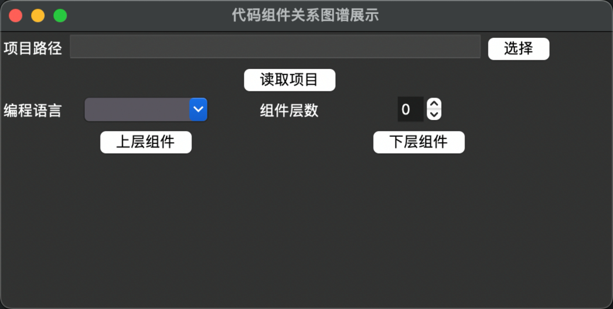
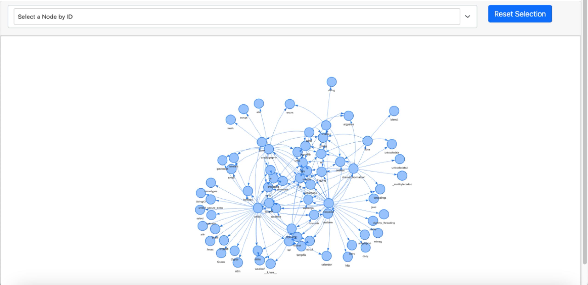
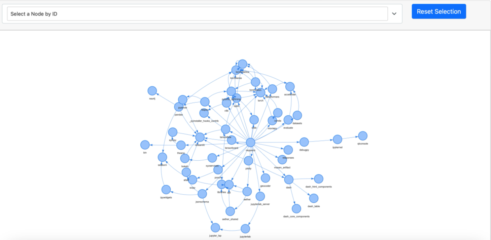

# Code-Dependency-Visualization
This tool analyzes code dependencies, building upper and lower layer call graphs for components. It supports Python, Java. Using a DFS algorithm, it scans files, parses code via AST or regex, and stores dependencies in a Neo4j graph database. The tool also offers a visualization interface using tkinter and pyvis to display component maps

# 1.**项目介绍**

1. 构建出一个组件所有的上层组件的调用关系图
2. 构建出一个组件被所有的下层组件的调用关系图
3. 一个组件被定义为一个库/包/项目
4. 支持以Python,Java,C,C++为编程语言的组件图谱的构建（目前支持python3和java1.8代码，其他语言待完善）

# 2. 实现的细节

**项目包/依赖引用获取算法**

算法利用编程语言相对固定的语法规则来获取一个项目文件对其他库或项目的引用信息。算法的具体步骤如下：

1.通过DFS算法扫描出项目的文件夹中所有的代码文件，并通过代码文件判别出该项目所使用的编程语言。DFS算法是一种遍历图结构的方法，可以用来找出文件夹中所有的文件。使用DFS算法的原因是它可以保证找到所有的文件，而不会漏掉或重复扫描某些文件。

2.通过AST(语法分析树)或正则表达式解析每一个代码文件，从而获取获取单个代码文件对其他库或代码文件的引用。

3.汇总所有的代码的引用，对其进行去重，得到项目的的所有引用。

**项目引用存储算法**

1. 根据项目的所有引用，生成对应的cypher语句列表L。cypher是一种图数据库语言，可以用来创建或更新图结构的数据。
2. 通过图数据库neo4j的接口,将L输进数据库执行，图数据库生成对应的节点和关系。图数据库可以高效地存储和查询图结构的数据。

**项目上层组件和下层组件搜索算法**

1. 根据项目名和预先设定好的最大组件层数，生成对应的cypher语句Q。
2. 通过图数据库neo4j的接口,将Q输进图数据库执行,在执行前图数据库会自动选择合适。的路径搜索算法，图数据库执行完后返回执行结果R，既多条路径信息。路径信息包含一个起始节点、一个终止节点和一系列中间节点和关系。
3. 利用pyvis库将路径信息R转化为可视化的网页，pyvis是一个Python库，可以方便地将图结构的数据转化为交互式的网页，让用户可以直观地看到项目之间的组件层次关系。（ 官方文档：http://pyvis.readthedocs.io/en/latest/）

# 3. **接口定义**

| **接口**                                                     | **功能说明**                                                 |
| ------------------------------------------------------------ | ------------------------------------------------------------ |
| single_library.py：parse_library(library_path, current_library=None,language=None, check_upper_relationship=True) |                                                              |
| 解析以Python,Java,C,C++为编程语言的项目，解析路径为library_path的项目依赖的上层组件，并将解析出的结果存储进neo4j图数据库。check_upper_relationship属性指定是否检测该项目的上层组件。 |                                                              |
| [neo.py](http://neo.py):create_relationships(language, start_node, end_nodes) | 指定编程语言language，在数据库中建立节点start_node到节点end_nodes的UPP(上层组件)的关系，同时建立节点end_nodes到节点start_node的LOW(下层组件)的关系。 |
| [neo.py](http://neo.py):check_upper_relationship(language, node_name) | 指定编程语言language，和节点名node_name，查找该节点是否存在UPP关系，若有则返回True,否则返回False。 |
| [neo.py](http://neo.py/):find_all_relationships(node_name, language, level, relation='UPP') | 检索图数据库中名为node_name的组件的                          |
| level层以内的上层组件或下层组件，并将结果传递给visualize_result接口 |                                                              |
| [neo.py](http://neo.py/):find_all_relationships(node_name, language, level, relation='UPP') | 将节点和关系结果query_graph和节点命名属性nodes_text_properties可视化为网页形式 |
| single_library.py                                            | 解析项目文件目录下的代码文件                                 |
| [neo.py](http://neo.py/)                                     | 图数据库接口和网页可视化接口                                 |
| garph_interface.py                                           | 图形化接口                                                   |

# 4. **可视化界面**

主要操作界面使用tkinter库实现，组件图谱的展示界面使用pyvis库实现

1. 主要操作界面如图1所示，

2. 以resquests组件为例，搜索他两层以内上层组件的结果，如图2所示。

3. 以resquests组件为例，搜索他三层以内下层组件的结果，如图3所示。

   

   

图1



图2



图3

# 5.运行

1. 安装图数据库neo4j，安装完后在neo.py文件下配置neo4j，如：

```python
URI = "neo4j://localhost:7687"
AUTH = ("neo4j", "12345678")
```

2.运行graph.interface.py启动图形化操作界面

3.在图形界面中，项目路径中填入要读取的项目文件夹，点击读取项目，会将项目的代码依赖关系存储到本地neo4j库中。

4.在项目路径中输入项目路径/项目名/库名，再选择对应的编程语言，最后选择要展示的关系层数。点击上层组建或下层组建将自动构建相关的可视化页面。

该项目是一个用于分析代码依赖关系的工具。它能够构建组件的上层和下层调用关系图，支持Python、Java、C和C++等编程语言。该工具使用DFS算法扫描项目文件，通过AST或正则表达式解析代码，并利用Neo4j图数据库存储依赖关系。它还提供了可视化界面，使用tkinter和pyvis库来展示组件图谱。
